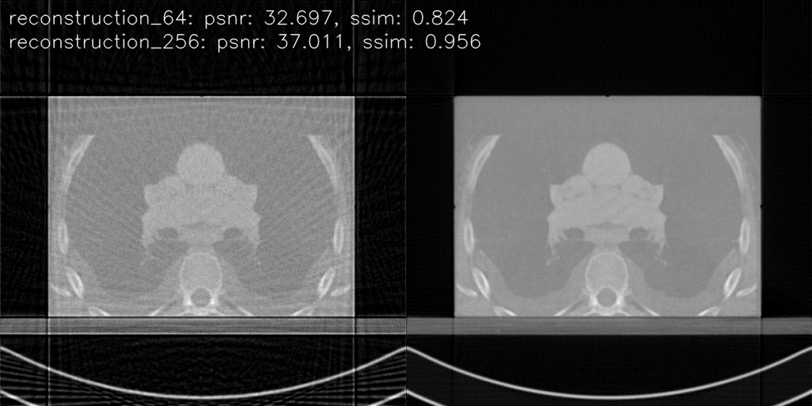
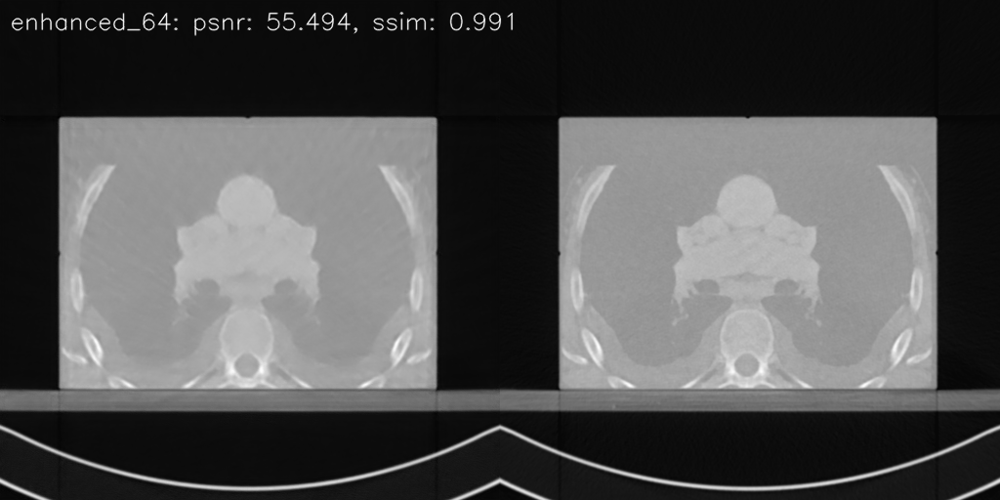

# Important Note
This repository is not maintained anymore. I decided to work on another dataset with annotated masks: [LIDC-IDRI](https://wiki.cancerimagingarchive.net/display/Public/LIDC-IDRI). I'll need a way to handle the annotations and it will just be easier to start from the begging. I'll keep this repository for future reference.

# Information
This repository is the implementation of the given flowchart (red blocks are marked for other purposes, it doesn't indicate any error or missing part):


You can use this repository to extract CT scans from a 3D models from DICOM files. The pipeline is designed to be used with the [Cancer Imaging Archive](https://www.cancerimagingarchive.net/nbia-search/?CollectionCriteria=LIDC-IDRI):SPHNQA4IQI dataset. However, it can be used with any dataset with the same format.

# Example Usage
I used a sample from the dataset "SPHNQA4IQI" on [here](https://www.cancerimagingarchive.net/nbia-search/?CollectionCriteria=LIDC-IDRI). 

1 - Download the dataset.

2 - Run [process_dataset.py](example_usage/process_dataset.py) with the path of the dataset to get a hdf5 file that contains:
- angles (118, 1, 256): 
  - The angles in which the x-ray projections are taken.
  - Shape: (number_of_patients, number_of_angle_resolvers_number_of_projection_angles)
- dark_field_images (118, 343, 726): 
  - The dark field images for preprocessing.
  - Shape: (number_of_patients, *projection_resolution)
- flat_field_images (118, 343, 726): 
  - The flat field images for preprocessing.
  - Shape: (number_of_patients, *projection_resolution)
- original_object (118, 343, 512, 512): 
  - The original objects from the dataset.
  - Shape: (number_of_patients, *object_resolution)
- pre_processed_projection_images (118, 1, 1, 256, 343, 726): 
  - The preprocessed projection images.
  - Shape: (number_of_patients, number_of_angle_resolvers, number_of_pre_processors, *projection_resolution)
- projection_images (118, 1, 256, 343, 726): 
  - The x-ray projection images.
  - Shape: (number_of_patients, number_of_angle_resolvers, *projection_resolution)
- reconstructed_object (118, 1, 1, 1, 343, 512, 512): 
  - The objects reconstructed via filtered back projection.
  - Shape: (number_of_patients, number_of_angle_resolvers, number_of_pre_processors, number_of_reconstructors, *object_resolution)

3 - Run [expand_dataset.py](example_usage/expand_dataset.py) to expand the dataset to have more reconstruction methods. reconstructed_object will now have the shape (118, 1, 1, 4, 343, 512, 512).

4 - Run [train_model.py](example_usage/train_model.py) to train a model to infer the reconstruction quality for 64 angles. It will import from [custom_datasets.py](example_usage/custom_datasets.py) and [cnn_model.py](example_usage/cnn_model.py). 

5 - Run [test_model.py](example_usage/test_model.py) to test the model. It will import from [train_model.py](example_usage/train_model.py). (Adjust parameters according to yourself first)

If the code runs without any errors, you should have a result similar to this:




First image shows the reconstruction done with 64 angles and 256 angles. Second image shows the reconstruction done with 64 angles+cnn and the original object itself.

# Commands
To package: 
```bash
py -m pip install --upgrade build
py -m build --sdist --wheel
```

To install:
```bash
py -m pip install --no-deps git+https://github.com/kaanbuyukdemirci/computed_tomography_pipeline.git
```

# License
This project is licensed under the MIT License - see the [LICENSE](LICENSE) file for details.

# To Do (No longer maintained)
- [x] Add documentation